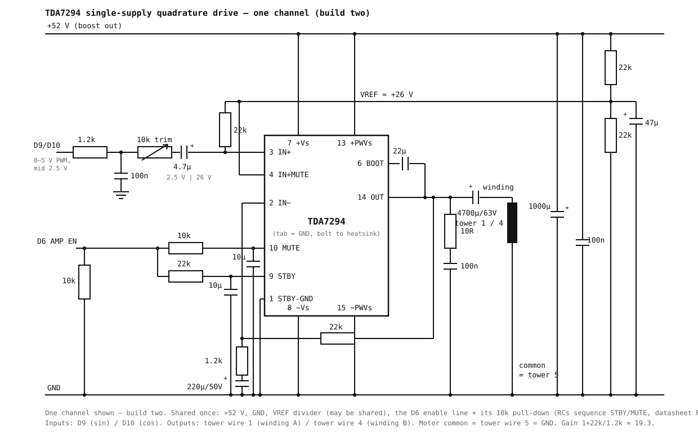

# Quadrature amplifier stage — two TDA7294, single supply, perfboard

Drives the 10W707's two motor windings with sin/cos from the firmware2 DDS.
References: ST TDA7294 datasheet (April 2003) — Figure 1 (typical application,
our base circuit), Figure 16 (turn on/off sequence — implemented by firmware2's
amplitude ramps), Figure 17 (single-signal mute/stby — exactly our scheme: one
enable line, the per-pin RCs do the sequencing). Note: the TDA7294 datasheet itself has *no* single-supply
figure; the single-supply pattern below follows the TDA7293 datasheet's
"single supply amplifier" configuration, adapted.

## Supply

13.8 V input → DX200W-6 boost set to **52 V** → both channels.
The chip sees 52 V total (= ±26 V equivalent; allowed 20–80 V).
Bring-up: start with the boost at ~30 V, raise to 52 V when clean.

**4700 µF/63 V low-ESR at the boost output is required**, on top of the
1000 µF/63 V + 100 nF at each chip's pins 13/15. A single-ended amp draws a
half-wave rectified current from the rail — 1.1 A at the crest against a 0.36 A
average into a 22 Ω load — and the converter's loop answers that step with a
14 V p-p, 0.5 ms burst *at its own terminals*, which dragged the rail down enough
to put a 1.7 V dip in the output crest. (At the chip, 70 cm of wire away, the
same burst measures 1.6 V p-p before the local decoupling is moved onto pins
13/15 and 0.88 V after — moving it does not fix the crest.) Measured on channel A
at 17.5 V RMS/60 Hz with the cap fitted: sag at the chip 0.93 V p-p, ripple
0.25 V p-p typical, output residual 0.69 %.

## TDA7294 pinout (Multiwatt15, top view; TAB = −Vs → bolts bare to grounded heatsink)

| Pin | Function | Our connection |
|-----|----------|----------------|
| 1 | STBY-GND | GND |
| 2 | IN− | feedback network |
| 3 | IN+ | signal in (biased to VREF) |
| 4 | IN+MUTE | VREF (same DC as IN+ → no step when muting) |
| 5, 11, 12 | N.C. | — |
| 6 | BOOTSTRAP | 22 µF/63 V to OUT, **+ toward pin 6** — it sits ≈ Vs/2 above OUT, and swings above the +Vs rail on positive peaks |
| 7 | +Vs (signal) | +52 V |
| 8 | −Vs (signal) | GND |
| 9 | ST-BY | 22 kΩ ← AMP_EN line (+10 µF at pin to GND) |
| 10 | MUTE | 10 kΩ ← AMP_EN line (+10 µF at pin to GND) |
| 13 | +PWVs (power) | +52 V |
| 14 | OUT | bootstrap, feedback, Zobel, output cap |
| 15 | −PWVs (power) | GND |

## Per-channel schematic (build two; identical except the DDS pin and winding)

Gain = 1 + 22k/1.2k ≈ 19.3 (25.7 dB); the AC-coupled feedback leg makes DC
gain unity, so OUT self-centers at VREF.

Component notes — corners chosen for 5 Hz drive, not audio:

- **C_in = 4.7 µF** (≥50 V; film, or electrolytic + toward the amp). With the
  22 k bias impedance the corner is 1.5 Hz. (A 470 nF "audio" value would put
  the corner at 15 Hz and lose 10 dB at the 5 Hz crawl.) This cap is also what
  aligns the levels: the Arduino side sits at 2.5 V DC, the amp side at
  VREF ≈ 26 V — the cap absorbs the difference, only the AC swing passes.
- **Two-pole input filter — 1.2 kΩ + 100 nF twice.** One pole leaves a
  62.5 kHz triangle of ≈ 0.33 V p-p, which the ×19.3 gain turns into ~3 V p-p
  on the winding (measured 2.96 V p-p mid-slope, 0.94 V p-p at the crest, where
  the PWM duty approaches its extreme and the d·(1−d) residue collapses). Two
  poles take that to ~65 mV p-p. The cost at 60 Hz is 7.7° of lag and 0.9 % of
  amplitude — identical in both channels, so the quadrature is untouched; at
  5 Hz it is 0.6°. It also buys back ~0.5 V of headroom at the crest and keeps
  the carrier's harmonics off 35 m of cable.
- **10 k trim wired as a divider**: top to the 1.2 k/100 n node, bottom to GND,
  wiper to C_in. A series rheostat would only reach 22/(22+10) = 0.69× against
  the 22 k bias impedance — short of the 0.53× the levels below need — and would
  leave the wiper with no DC path, so C_in stays charged to VREF and dumps into
  the Arduino pin on connection.
- **Feedback cap = 220 µF / 50 V, + toward IN−**: in single-supply operation it
  charges to VREF (≈26 V), hence the voltage rating; 1.2 k × 220 µF puts the
  gain corner at 0.6 Hz. (The datasheet's 22 µF would roll gain off below 6 Hz.)
- Both channels share the same corner frequencies, so whatever phase shift the
  coupling networks add is identical in both — the 90° quadrature is preserved.

## Shared connections

| Net | Connection |
|-----|-----------|
| GND | boost −out, both channels, motor common (tower wire 5 + shield), Arduino GND |
| AMP_EN line | Arduino D6 → all four series resistors (both chips' MUTE 10 kΩ and STBY 22 kΩ); one 10 kΩ pull-down to GND. The RC time constants sequence STBY before MUTE, per datasheet Fig. 17 single-signal control. D7 is free |
| Channel A in | Arduino D9 (sin) via the two-pole RC (1.2 kΩ + 100 nF, twice) |
| Channel B in | Arduino D10 (cos) via the two-pole RC (1.2 kΩ + 100 nF, twice) |
| Channel A out | tower wire 1 (winding A) |
| Channel B out | tower wire 4 (winding B) |

Star-ground at the boost output: power returns (Zobel, output caps' loads,
bulk caps) and signal returns (VREF divider, feedback caps, input networks)
meet at one point. Keep the output caps' return path short.

## Levels

DDS fundamental after the two-pole RC ≈ 1.75 V RMS max → trimmer to ≈ 0.93 V RMS →
×19.3 → **18 V RMS** at the winding at 60 Hz (design flux, 0.3 V/Hz).
Set each channel's trimmer on the dummy load; match the two channels.

Headroom: **V_pk ≤ rail/2 − sag − V_sat**, with V_sat ≈ 0.7 V measured at
1.1 A and sag ≈ 0.6 V peak with the bulk cap fitted. At 52 V that caps the
winding at 24.7 V pk = 17.5 V RMS, so the design point leaves no margin —
raise the rail rather than the trimmer if more is needed.

The output cap + 20 Ω winding form a 1.7 Hz high-pass: at the 5 Hz crawl this
costs ~0.5 dB and ~19° phase — equal in both channels, so the 90° quadrature
between them is preserved.

## Position sensing under this drive

Grounding wire 5 (motor common **and** pot wiper) would pin the relay-era
wiper-on-A0 reading to 0 V. Rewire the sensing at the terminal block:

- 5 V → 820 Ω (doubles as the first filter resistor) → A0 node → **tower wire 2**
- tower wire 3: spare (optionally a second divider to A1 later — the two
  segments must sum to the ≈1 048 Ω track, a free cable-health check)
- tower wire 5: GND (star point), as this schematic requires

The divider's hyperbolic V(R) is inverted exactly in firmware
(`position_ohms()`), and R is linear in angle — no difference amplifier
needed. R_fixed = 820 Ω (near-optimal worst-case slope, ~18% more span than
1.2 k): expected span ≈ 0.57–2.61 V for the measured 106–896 Ω swing.
Recalibrate `O`/`F` after the rewire (calibration is stored in ohms now).

## Bring-up checklist

1. Boost at ~30 V, no load: check VREF ≈ Vs/2. Then jumper AMP_EN to +5 V (not
   from D6 — the firmware drives it low) and check OUT ≈ Vs/2 and pin 6 a few
   volts below +Vs (measured 25.2 V on a 30 V rail — the datasheet specifies no
   quiescent bootstrap voltage; what matters is that it is neither at OUT nor at
   the rail). In standby the output stage is off and OUT floats, so those two
   nodes only read true in play.
2. 22 Ω dummy loads, 60 Hz drive: trim both channels to equal amplitude;
   scope for oscillation (Zobel fitted), feel heatsink. (22 Ω ≈ |Z| of a
   winding at 60 Hz — measured 20 V / 1 A, mostly inductive; the 6 Ω figure
   is DC resistance only and is not the operating point.)
3. Boost to 52 V, repeat; verify ~18 V RMS, mute sequencing (no thump).
4. Motor: starting behaviour at 5–15 Hz, reversal, winding currents
   (expect symmetric ~1 A), motor + heatsink temperature after full rotations.
5. RX noise check on the HF bands while rotating.
